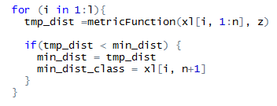
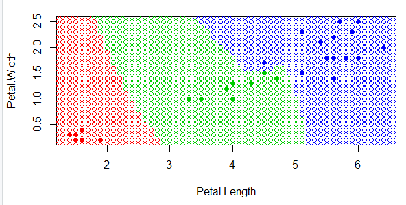

<!DOCTYPE html>
<html>
<head>
  <meta charset="utf-8">
  <base href="https://github.com/PavlyukovVladimir/SMPR/blob/master/" ></base>
</head>
<body>
  
  # Задачи классификации
  
  
 
  
 ## Метрические алгоритмы классификации 
  
 
  
  
<ol>
Во многих прикладных задачах измерять степень сходства объектов существенно проще, чем формировать признаковые описания.При рассмотрении таких сложных объектов, как фотографии, временные ряды, подписи, мы обнаруживаем, что сравнивать их между собой выгоднее и проще, чем изобретать признаки и сравнивать признаковые описания.Действительно, если мера сходства подобрана удачно, то зачастую оказывается, что <b>схожим объектам очень часто соответствуют схожие объекты</b>.Если формализовать это высказывание: классы образуют компактно локализованные подмножества. Это предположение принято называть <b>гипотезой компактности</b>.
  </ol>

  
  
  ## Алгоритм ближайших соседей
  
  
Объект X принадлежит такому классу Yi,к которму относится ближайших объект обучающей выборки Xi.

  
  ## 1.  1NN
  
  
Алгоритм 1NN относит классифицируемый объект u ∈ Xℓ к тому классу, которому принадлежит ближайший к нему обучающий объект.
  
Единственное достоинство этого алгоритма — простота реализации. Недостатков гораздо больше:

• Неустойчивость к погрешностям. Если среди обучающих объектов есть выброс — объект, находящийся в окружении объектов чужого класса, то не только он сам будет классифицирован неверно, но те окружающие его объекты, для которых он окажется ближайшим, также будут классифицированы неверно.

• Отсутствие параметров, которые можно было бы настраивать по выборке. Алгоритм полностью зависит от того, насколько удачно выбрана метрика ρ.

• В результате — низкое качество классификации.

 
 
Код: задана некоторая выборка Xl, состоящая из объектов. Затем подбирается метрика, в данном случае используется евклидово расстояние.
  
 

  
  
Далее сортируем объекты в порядке увеличения расстояния  относительно заданой точке и и тогда заданая точка будет принадлежать классу элемента стоящего первый в отсортированном списке

  

  
   
 

  
  
</body>
</html>
